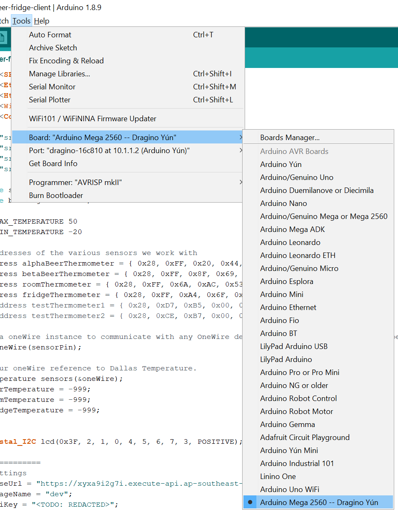
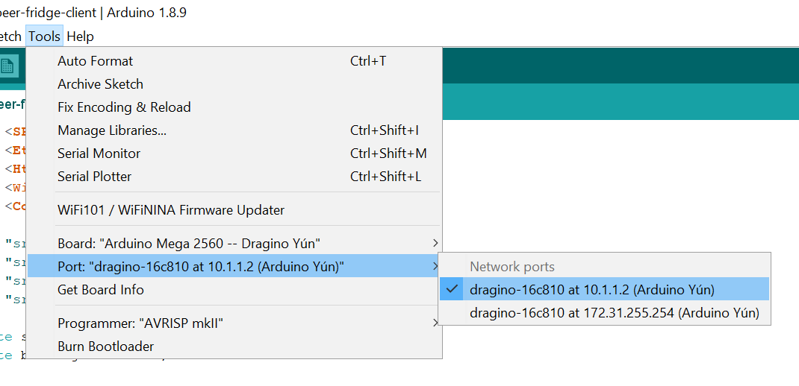
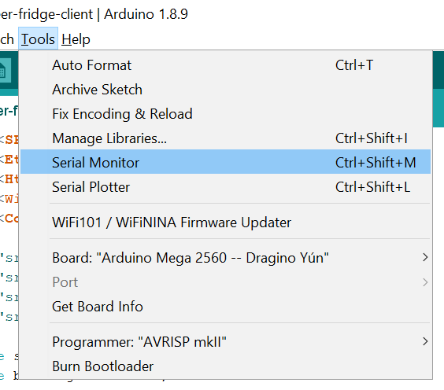

# minfos-beer-fridge-client
Arduino code that runs on the MBF fridge box.

The code is pretty simple, but because we are using a Yun shield the deployment and debugging steps are a bit different to a typical Arduino sketch (in Arduino parlance a source code file is called a sketch).

## How to update the AWS credentials
The MBF system is intended to be zero maintenance. From time-to-time, however you may need to make a code change. The most likely reason for this is if you re-deploy the [MBF serverless stack](https://github.com/hoppy1977/minfos-beer-fridge), which would cause a new API endpoint to be generated. 

The below instructions describe how to update the AWS credentials in the firmware running on the MBF device.

### Prerequisites
This guide assumes that you have already deployed the [MBF serverless stack](https://github.com/hoppy1977/minfos-beer-fridge), and taken note of its endpoint.

### 1. Set up the hardware
1. Plug the 12V power adapter into the MBF device. 
While the Arduino can run off the 5V provided by USB, 12V is required to power the Yun shield. The device will not function correctly if you try to use USB power alone.
2. Plug an ethernet cable into the device. 
WiFi has been disabled on the Yun shield, so you will not be able to deploy your changes to the device until you have wired network connectivity.

### 2. Configure the Arduino IDE
2. Next we need to tell the IDE about the board/shield combo that we want to upload the code to. 
The IDE knows how to work with all the standard Arduino boards, but because the Arduino Mega2560/Yun shield combo is a little unusual we need to configure the IDE to handle it. 
    1. Make sure the Arduino IDE is shut down.
    2. Open the following file `C:\Program Files (x86)\Arduino\hardware\arduino\avr\boards.txt`.
    3. Paste the contents of the `ArduinoBoardsUpdate.txt` file to the end of `boards.txt`.
    4. Save the file.
    5. Restart the Arduino IDE.

3. Set the board type. 
If you completed the previous step correctly, you should now have a new board type available for use: 
 
Select the new 'Arduino Mega 2560 -- Dragino Yun' option.

4. Set the port. 
If you have followed the instructions so far you should have one or two ports available under the Tools -> Port menu: 
 
Select the `10.1.1.2` option.

You are now ready to start making changes to the code!

---
Note:
The Arduino IDE is very unpleasant to use. You may prefer to use Visual Code with the [Arduino extension](https://marketplace.visualstudio.com/items?itemName=vsciot-vscode.vscode-arduino). This provides a much more pleasant development experience, but unfortunately you will still need to use the Arduino IDE to upload and debug your code.  

---

### 3. Update the AWS credentials
All the Arduino code can be found in the `minfos-beer-fridge-client.ino` sketch.

If the endpoint of the minfos-beer-fridge has changed you will have to update the Arduino firmware on the device to use the new AWS credentials:
1. *API endpoint:* this is given to you when you deploy the [MBF serverless stack](https://github.com/hoppy1977/minfos-beer-fridge). 
Use this value to populate the `baseUrl` variable in the code.
2. *API key:* This can be obtained from Systems Manager Parameter Store. The parameter name is:
`/MinfosBeerFridge/ApiKeys/Client` 
Use this value to populate the `apiKey` variable in the code. 

### 4. Uploading Code
Once your hardware and IDE are set up, just hit the Upload button ().
You will then be asked for the password for the Yun shield (the IDE is using the Yun shield to write the sketch to the Arduino Mega2560 board). The password is 'dragino'.
The upload should take about 30 seconds.

If all has gone well the LCD should indicate the device is reading temperatures and uploading them to AWS every few seconds. A response code of `200` is expected for every submission.  
Congratulations - you have now updated the firmware on the device!

## Debugging
If you want to see a little more about what is going on, simply open up the serial monitor in the IDE: 
 
You may be asked for the password again ('dragino'). 
The display should show the results of the `Console.println()` statements. 
Unfortunately, because the code is running on the device it is not possible to set breakpoints or watch variables. So if in doubt - print it out.

## References
* [minfos-beer-fridge](https://github.com/hoppy1977/minfos-beer-fridge) (backend serverless stack)